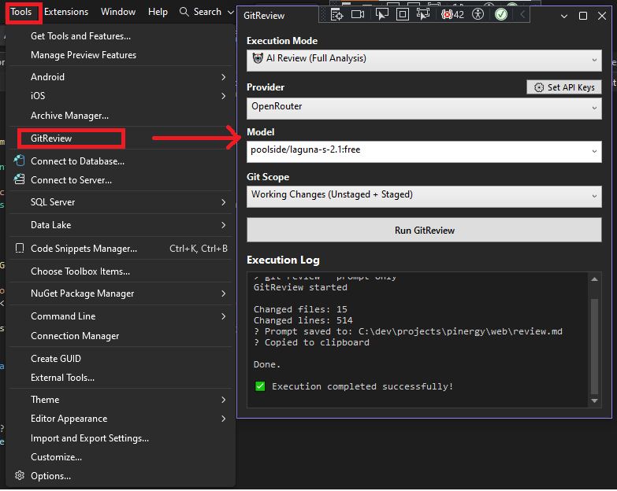

# GitReview for Visual Studio

GitReview brings AI-powered code reviews directly into Visual Studio. Analyze your Git diffs before committing or creating pull requests using top LLM providers, including OpenRouter, Google Gemini, and DeepSeek.

<p align="center">
  
</p>

## Features

* Instant AI Code Reviews: Get inline feedback, bug detection, and optimization suggestions right inside Visual Studio.
* Multiple Providers: Seamlessly switch between OpenRouter, Google Gemini, and DeepSeek.
* Custom Model Selection: Choose specific models (e.g., `gemini-2.0-flash`, `deepseek-chat`) directly from the extension UI.
* Flexible Execution Modes:
* AI Review: Full analysis displayed in the output window.
* Prompt Only: Generates a formatted review prompt and copies it to your clipboard.
* Raw Diff: Extracts clean Git diff patches.
* Secure Settings Integration: Manage API keys safely via standard Visual Studio options.

## Getting Started

### Prerequisites
`GitReview.VisualStudio` relies on the `git-review` CLI tool. Make sure it is installed on your machine:

```bash
dotnet tool install -g wieseknows.GitReview
```

### Installation & Setup

Install GitReview from the Visual Studio Marketplace.

Open Visual Studio and go to Tools -> Options -> GitReview -> General.

Enter your API key(s) for your preferred provider (OpenRouter, Gemini, or DeepSeek).

Open any solution inside a Git repository.

Open the tool window via View -> Other Windows -> GitReview.

## Usage

Open the GitReview tool window.

Select your desired Execution Mode (*AI Review*, *Generate Prompt Only*, or *Raw Git Diff*).

Select your AI Provider and target Model.

Click Run GitReview.

## Configuration

You can pre-configure default environment variables globally on your machine:

| Environment Variable | Description |
| :--- | :--- |
| `OPENROUTER_API_KEY` | API Key for OpenRouter |
| `GEMINI_API_KEY` | API Key for Google Gemini |
| `DEEPSEEK_API_KEY` | API Key for DeepSeek |
| `GIT_REVIEW_PROVIDER` | Default AI provider (`openrouter`, `gemini`, or `deepseek`) |

## License

Distributed under the MIT License.